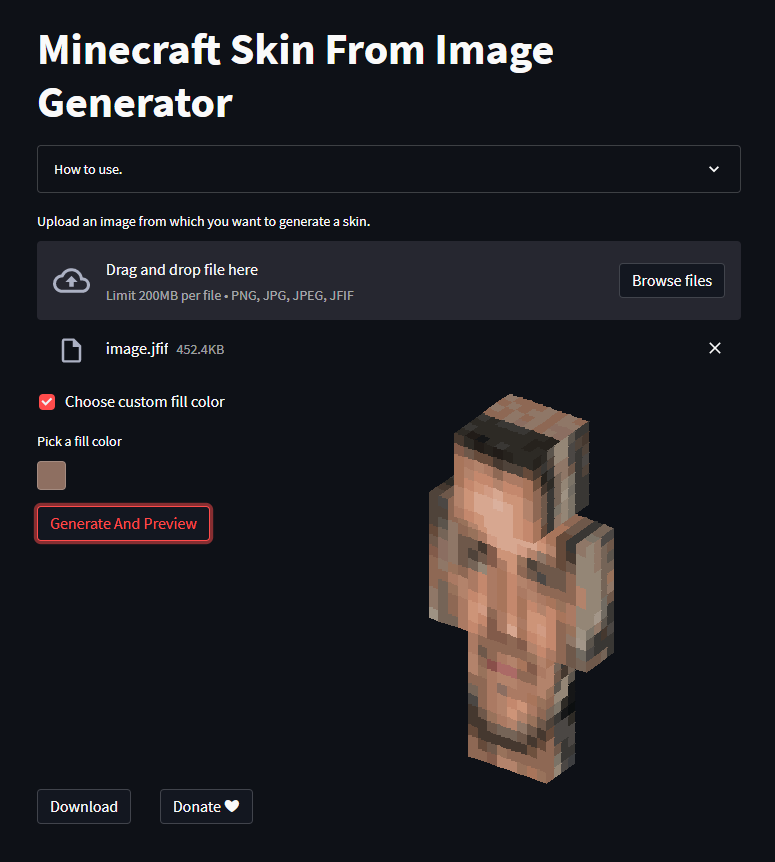
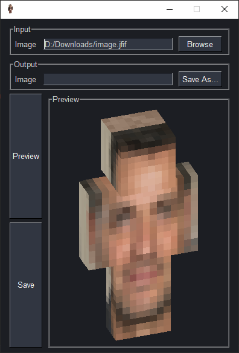

# minecraft_skin_generator
App made to generate mc skins from images

## Web interface
Web interface made using the streamlit package is accesible trough the url below  
Web app 🌐: https://mrcoin2-minecraft-skin-generator-main-d7wh37.streamlitapp.com/  
  

## Local GUI version
Local Gui version is coded using pysimplegui and is accessible by running **gui_main.py**  
  

